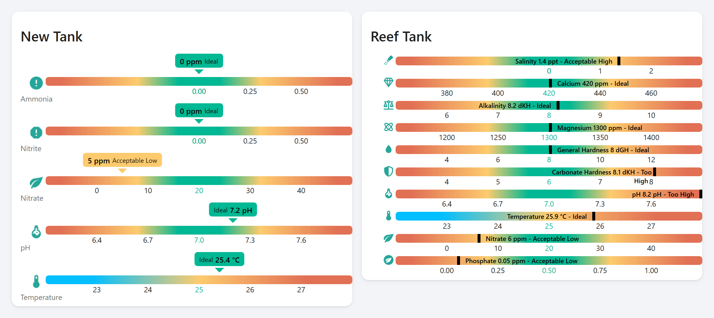

# Aquarium Monitor Card

[![Release][release-shield]][release-link] [![HACS][hacs-shield]][hacs-link] [![GitHub Activity][commits-shield]][commits-link]

> Monitor your aquarium water parameters to keep your fish, corals, and plants healthy, all from your Home Assistant dashboard.



[See the eight ways to configure this card](example/screenshots.md)

---

## Why this card?

Stable water chemistry is the difference between a thriving tank and a crash. This card tracks up to **15 parameters** with preset ideal ranges for freshwater and reef tanks.

Gradient bars instantly highlight out-of-range values so you can act **before your livestock is stressed**, not after.

Presets are tuned for general freshwater aquariums by default. A reef is a different chemistry: `tank_type: reef` switches the readings whose published reef targets differ, and any preset can still be overridden sensor by sensor.

### What you can do

- Track the **nitrogen cycle** (ammonia → nitrite → nitrate) during new tank cycling
- Monitor pH and KH stability for **sensitive species** like discus or shrimp
- Watch calcium, magnesium, and alkalinity for **reef tank coral growth**
- Keep CO2 dialed in for **planted tank** photosynthesis
- Spot salinity drift in your **marine tank** between water changes

---

## Sensors (15 presets)

Every sensor comes with **preset ideal ranges**: just point to your entity and the card handles the rest. Override any value to match your setup.

### Nitrogen Cycle

*The #1 killer in aquariums. Ammonia and nitrite must be zero in a cycled tank.*

  

| Sensor | Key | Unit | Defaults |
|--------|-----|------|:----------------:|
| Ammonia | `ammonia` | ppm | 0.25 / 0.5 / 1 / 2 |
| Nitrite | `nitrite` | ppm | 0.25 / 0.5 / 1 / 2 |
| Nitrate | `nitrate` | ppm | 20 |

### Water Chemistry

*Stability matters more than hitting exact numbers. Sudden shifts stress fish.*

    

| Sensor | Key | Unit | Defaults |
|--------|-----|------|:----------------:|
| Temperature | `temperature` | °C | 25 |
| pH | `ph` | pH | 7.0 |
| General Hardness | `gh` | dGH | 8 |
| Carbonate Hardness | `kh` | dKH | 6 |
| CO2 | `co2` | mg/L | 20 |

### Reef & Saltwater

*Corals consume calcium and alkalinity daily. Keeping them stable is key to growth.*

    

| Sensor | Key | Unit | Defaults |
|--------|-----|------|:----------------:|
| Salinity | `salinity` | ppt | 1 / 3 / 10 / 35 |
| Specific Gravity | `specific_gravity` | sg | 1.025 |
| Calcium | `calcium` | ppm | 420 |
| Magnesium | `magnesium` | ppm | 1300 |
| Alkalinity | `alkalinity` | dKH | 8 |

### Maintenance

*Prevent phosphate-driven algae and catch evaporation before it concentrates salts.*

 

| Sensor | Key | Unit | Defaults |
|--------|-----|------|:----------------:|
| Phosphate | `phosphate` | ppm | 0.5 |
| Water Level | `water_level` | % | 100 |

For detailed explanations of each sensor and why it matters, see [Sensor Details](docs/sensors.md).

Some of the entities this card reads have to be built in Home Assistant first. Ready-made `template` sensors for that are in [Recipes](docs/recipes.md).

---

## Compatible Hardware

Community-tested devices that work with this card:

| Device | Integration | Description |
|--------|-------------|-------------|
| Seneye USB Reef/Home | Seneye custom component | Monitors pH, ammonia, temperature, and light. USB connected. |
| GHL ProfiLux | MQTT / REST API | Professional aquarium controller with pH, ORP, conductivity, temperature probes. |
| Atlas Scientific EZO sensors + ESPHome | ESPHome | Lab-grade pH, EC, DO probes on an ESP32. Fully customizable. |
| Xiaomi / Aqara temperature sensors | ZHA / Zigbee2MQTT | Affordable Zigbee temperature sensors. Waterproof versions available for sumps. |

> Know a device that works? [Open an issue](https://github.com/wilsto/aquarium-monitor-card/issues) to add it!

---

## Installation

### HACS (recommended)

1. Open [HACS](https://hacs.xyz/) → **Frontend** → search for **Aquarium Monitor Card**
2. Install and reload your browser

[](https://my.home-assistant.io/redirect/hacs_repository/?owner=wilsto&repository=aquarium-monitor-card&category=plugin)

### Manual

1. Download `aquarium-monitor-card.js` from the [latest release](https://github.com/wilsto/aquarium-monitor-card/releases)
2. Copy to `config/www/community/aquarium-monitor-card/`
3. Add resource: `/local/community/aquarium-monitor-card/aquarium-monitor-card.js` (type: module)

---

## Quick Start

```yaml
type: custom:aquarium-monitor-card
title: "My Aquarium"
sensors:
  temperature:
    entity: sensor.your_temperature_sensor
  ph:
    entity: sensor.your_ph_sensor
  ammonia:
    entity: sensor.your_ammonia_sensor
```

That's it! The card uses sensible defaults for everything else.

---

## Configuration

| Option | Type | Default | Description |
|--------|------|---------|-------------|
| `title` | string | - | Card title |
| `sensors` | object | - | Sensor definitions (see below) |
| `status_entity` | string | - | Entity whose state is shown as a badge at the top of the card |
| `battery_entity` | string | - | One battery for the whole device, shown once beside the status |
| `tank_type` | string | `freshwater` | Which tank this is, `freshwater` or `reef`. Picks the thresholds of `ph`, `salinity` and `phosphate`, see below |
| `display.compact` | boolean | `false` | Compact display mode |
| `display.show_names` | boolean | `true` | Show sensor names |
| `display.show_icons` | boolean | `true` | Show sensor icons |
| `display.show_units` | boolean | `true` | Show units |
| `display.show_labels` | boolean | `true` | Show range labels |
| `display.gradient` | boolean | `true` | Show gradient bar |
| `display.show_last_updated` | boolean | `false` | Show last update time |
| `display.name_font_size` | string | - | Font size of the sensor name, e.g. `0.8em` |
| `display.name_font_weight` | string | - | Font weight of the sensor name |
| `display.language` | string | `en` | Language code, one of the 17 shipped |
| `colors.*` | string | - | Any colour of the palette, see the Colours section |

### Freshwater or reef

A community tank and a reef are not the same water, so a single set of thresholds cannot serve both. `tank_type` says which one this card is watching, and that choice picks the thresholds of `ph`, `salinity` and `phosphate`.

```yaml
type: custom:aquarium-monitor-card
title: "My Aquarium"
tank_type: reef
sensors:
  ph:
    entity: sensor.your_ph_sensor
  salinity:
    entity: sensor.your_salinity_sensor
  phosphate:
    entity: sensor.your_phosphate_sensor
```

Leave the option out and you get `freshwater`, whose values are the ones listed in the Sensors table above. What the choice moves:

- **pH** (`ph`): `freshwater` 7.0 pH, `reef` 8.2 pH. A reef is kept at 8.1 to 8.4, higher than the ocean because calcification runs better there. The freshwater target would read as an emergency on a reef.
- **Salinity** (`salinity`): `freshwater` 1 / 3 / 10 / 35 ppt, `reef` 35 ppt. The two scales do not even have the same shape. Freshwater grades how far the water has drifted away from fresh, less being better; a reef grades how far it has drifted from the salinity of the ocean, in either direction.
- **Phosphate** (`phosphate`): `freshwater` 0.5 ppm, `reef` 0.06 ppm. A reef is run about ten times leaner. The freshwater target sits above every published reef ceiling, so a reef in real trouble would still read as acceptable.

Every other reading keeps one scale whatever the tank, **nitrate included**. Published reef targets for it disagree by a factor of five, from 2 to 10 ppm at one end to 5 to 50 at the other, so the card picks no winner between two credible sources: set `setpoint` and `step` on the sensor yourself if your own target is firm.

What you write on a sensor still wins over the tank type, which wins over the card's own preset. Anything other than `freshwater` or `reef` is refused with an error naming the accepted values, rather than quietly falling back: a typo would otherwise show a reef the freshwater scale, which is the failure this option removes.

> **This one is written in YAML.** The visual editor has no control for it yet, but it does not lose it either: open a card that sets `tank_type`, change anything else in the editor, and the option is still there.

### Per-sensor overrides

```yaml
sensors:
  temperature:
    entity: sensor.xxx        # required
    name: Custom Name         # override display name
    unit: "°C"                # override unit
    setpoint: 25              # ideal value
    min: 10                   # number = scale bound, string = tracking entity
    max: 40                   # same
    step: 2                   # threshold step for colors
    icon: mdi:thermometer     # MDI icon
    mode: centric             # centric | heatflow
```

Every option a sensor accepts:

| Option | Type | Description |
|--------|------|-------------|
| `entity` | string | **Required.** The entity to read |
| `attribute` | string | Read this attribute instead of the state. Missing attribute reads as unavailable rather than falling back |
| `name` | string | Override the displayed name |
| `unit` | string | Override the unit |
| `icon` | string | MDI icon, or `hide` to show none |
| `image_url` | string | Image instead of an icon |
| `setpoint` | number | The ideal value the bands are built around |
| `step` | number | Width of one band, so how tolerant the scale is |
| `step_low` | number | Band width below the setpoint, when it differs |
| `step_high` | number | Band width above the setpoint |
| `min_limit` | number | Lowest value the bar will show |
| `limits` | number[] | Four explicit boundaries. Replaces `setpoint` and `step`, which are then ignored |
| `direction` | string | `lower_is_better` (default) or `higher_is_better`, with `limits` |
| `mode` | string | `centric` or `heatflow`, when no preset decides it |
| `min` | number | string | Number = scale bound. String = entity placing a marker |
| `max` | number | string | Same |
| `status_entity` | string | A status for this measurement alone, shown as a badge beside it |
| `battery_entity` | string | Battery of this sensor. For one device with one battery, use the card-level option instead |
| `availability_entity` | string | Greys the row out when this entity is off |
| `setpoint_entity` | string | Reads the setpoint from an entity rather than a fixed number |
| `min_limit_entity` | string | Same, for `min_limit` |
| `derivative_entity` | string | A Home Assistant `derivative` helper watching this measurement. Its sign gives the direction of the trend chevron, its magnitude the number of chevrons |
| `derivative_scale` | number | How much slope is worth one chevron, and the floor below which none shows. Defaults to `0.1` |
| `last_updated_entity` | string | Where the measurement time comes from |
| `last_updated_attribute` | string | Attribute holding that time, e.g. PoolLab `measured_at` |

`min` and `max` accept two forms and the type decides: a **number** is a bound
of the visible scale, a **string** is an entity whose value places a tracking
marker on the bar.

Without them, the bar spans `setpoint ± 3 × step`, and the coloured zones
change every `step`. So `step` is what widens or narrows the green zone:
a larger `step` is more tolerant, a smaller one more strict.

### Every sensor needs a scale

A reading is only worth showing if it can be compared to something. A sensor
that carries no reference is **refused**: the card shows a warning in its place
and draws no bar for it, while the rest of the card keeps working.

A sensor has a scale when it has either of these:

- four explicit `limits`, or
- a `setpoint`, written here, read from `setpoint_entity`, or inherited from
  the preset.

The two near misses are worth naming, because both look like a scale:

- **`min` and `max` are not one.** They size the bar. A sensor with
  `min: 0, max: 100` and nothing else draws a full-width bar with the cursor in
  the right place, and still has nothing to judge the reading against.
- **`step` alone is not one either.** It is the width of a band, with no value
  to build the bands around.

Every preset on this card already carries a scale, so this only bites on a
sensor key the card does not know, or on a preset whose `setpoint` you
replaced with nothing.

### Quantities whose ideal is at one end

`centric` and `heatflow` both place the ideal value in the middle. For PM2.5,
where 0 is best, or ORP, where higher is better, give the four class
boundaries explicitly and say which way the scale reads:

```yaml
sensors:
  pm25:
    entity: sensor.pm25
    min: 0
    max: 20
    limits: [2, 5, 10, 15]    # four boundaries, replaces setpoint/step
    # direction: lower_is_better (default) | higher_is_better
```

### Several probes for the same measurement

A probe in the display tank and another in the sump, or one tank per shelf:
any sensor key accepts a **list** instead of a single block. Each entry
gets its own bar. Nothing to install, nothing to enable, it has always
worked.

```yaml
type: custom:aquarium-monitor-card
title: "My Aquarium"
sensors:
  temperature:
    - entity: sensor.temperature_display_tank
      name: Display tank
    - entity: sensor.temperature_sump
      name: Sump
```

- **Each entry takes the full set of options above.** `min`, `max`, `setpoint`, `icon`, `status_entity`, `battery_entity`, all of them, and they are independent.
- **The preset still applies to every entry.** `temperature` keeps its ideal range, its unit and its icon unless that entry overrides them.
- **Give each one a `name`.** Without it every entry falls back to the same default label, and the bars become impossible to tell apart.
- **`entity` is required on every entry.** A missing one stops the card with `Missing entity for temperature[1]`, the number being the position in the list counting from zero.

> **The visual editor edits these, but does not create them.** Once a preset is configured it leaves the *Add sensor* list, so the second entry is added in YAML. After that the editor shows both as *#1* and *#2*, each expandable and deletable on its own.

### Styling

The card renders a standard `ha-card`, so it responds to your Home Assistant
theme and to [card-mod](https://github.com/thomasloven/lovelace-card-mod) like
any other card.

> **Install card-mod first, it does not come with Home Assistant.**
> It is a separate frontend component, not part of this card and not
> bundled with it. Until it is installed a `card_mod:` block is simply
> ignored: the styles do nothing and no error says why.
>
> It is in the HACS default store. HACS → search **card-mod** → install →
> reload your browser. Everything in this section assumes it is there;
> installation details live in the
> [card-mod repository](https://github.com/thomasloven/lovelace-card-mod).

**Transparent, borderless:**

```yaml
type: custom:aquarium-monitor-card
card_mod:
  style: |
    ha-card {
      background: transparent;
      box-shadow: none;
      border: none;
    }
sensors: ...
```

**Sizes, colours, spacing**: target the classes below:

```yaml
card_mod:
  style: |
    .pool-monitor-title { font-size: 2rem !important; }
    .entity-icon { color: var(--error-color); }
    .gauge-scale { font-size: 1.1em !important; }
```

> **Why some rules need `!important`.** The card ships its styles as an
> adopted stylesheet, and those win over an injected one at equal
> specificity. So a property the card already sets (a font size, a bar
> height) needs `!important` or a more specific selector such as
> `h1.pool-monitor-title`. A property the card does **not** set, like the
> icon colour above, applies with no ceremony. Styling `ha-card` itself
> also works plainly: that rule crosses a shadow boundary, where the
> outer stylesheet wins.

| Class | What it is |
| --- | --- |
| `.pool-monitor-title` | Card title |
| `.entity-icon` / `.entity-icon-compact` | Sensor icon, normal and compact modes |
| `.gauge-scale` | Row of numbers under the bar |
| `.grid-item-text-box` | Sensor name and value |
| `.status-badge` | Status badge |
| `.battery-indicator` | Battery level indicator |
| `.progress-bar-child` | The coloured bar itself |
| `.cursor` / `.cursor-text` | Current-value marker and its label |

> Marker positions and colours are computed per reading and set inline, so
> they follow the sensor value rather than a stylesheet. Everything listed
> above is static and can be overridden.

### Colours

The bands are painted from an eight-colour palette. Override any of them
under `colors:`, in YAML or in the visual editor. No card-mod involved.

```yaml
colors:
  normal: "#00b894"
  warn: "#e17055"
```

| Key | Default | What it paints |
| --- | --- | --- |
| `colors.low` | `#fdcb6e` | One band out from the ideal, on either side of a centric scale |
| `colors.warn` | `#e17055` | The outer band, and the hot end of a `heatflow` scale |
| `colors.normal` | `#00b894` | The ideal band, in every mode |
| `colors.fair` | `#7ec181` | Second band of a `limits` scale, still acceptable but no longer ideal |
| `colors.cool` | `#00BFFF` | The cold end of a `heatflow` scale, and the low end of its gradient bar |
| `colors.hazardous` | `#8e44ad` | Worst band of a `limits` scale |
| `colors.marker` | `#000000` | The current-value cursor |
| `colors.hi_low` | `#00000099` | The `min` and `max` tracking ticks |

> `fair` and `hazardous` only appear on a scale built with `limits`, where
> the reading runs from good to bad in one direction. A centric scale never
> reaches them.

### Languages

17 languages supported: Català, Čeština, Dansk, Deutsch, English, Español, Français, עברית, Magyar, Italiano, Nederlands, Português, Português (Brasil), Română, Русский, Slovenčina, Svenska.

Set one with `display.language`, or pick it in the visual editor.

---

## Support

[](https://bmc.link/wilsto)

---

## Acknowledgments

This card wouldn't be what it is today without our amazing contributors!

- [arketec](https://github.com/arketec): Design of the derivative-driven trend indicators (chevrons), from his fork ([commit 4730f95](https://github.com/arketec/pool-monitor-card/commit/4730f95))
- [sierramike](https://github.com/sierramike): Home Assistant rendering compliance: the `ha-card` wrapper and the card picker registration ([pool-monitor-card#67](https://github.com/wilsto/pool-monitor-card/pull/67))
- [daveewall](https://github.com/daveewall): WaterGuru SENSE report that specified the card-level `battery_entity` and the per-sensor `status_entity` ([pool-monitor-card#77](https://github.com/wilsto/pool-monitor-card/issues/77))
- [ahuffman](https://github.com/ahuffman): Proposal to list several entities under one sensor type, which became the v2 configuration format ([pool-monitor-card#25](https://github.com/wilsto/pool-monitor-card/issues/25))
- [woopstar](https://github.com/woopstar): Showed that Danish plurals differ from one time unit to the next, which produced the `time_plural` block every locale carries ([pool-monitor-card#53](https://github.com/wilsto/pool-monitor-card/issues/53))
- [rocknrolla85](https://github.com/rocknrolla85): Named what both scale modes got wrong for ORP and TDS, which produced `direction: lower_is_better / higher_is_better` ([pool-monitor-card#85](https://github.com/wilsto/pool-monitor-card/issues/85))
- [Kraut-bob](https://github.com/Kraut-bob): Described the third scale mode, for readings whose best value is zero ([air-quality-card#2](https://github.com/wilsto/air-quality-card/issues/2))
- [Seebaer1976](https://github.com/seebaer1976): German translation
- [Splitti](https://github.com/splitti): German translation
- [Djgel](https://github.com/djgel): Portuguese translation
- [CosminFRC](https://github.com/CosminFRC): Romanian translation
- [Misa1515](https://github.com/misa1515): Slovak translation
- [ViPeR5000](https://github.com/ViPeR5000): Portuguese translation
- [Yehuda](https://github.com/Yehuda): Hebrew translation
- [mmiguel4](https://github.com/mmiguel4): Portuguese translation
- [MrSnakeSPb](https://github.com/MrSnakeSPb): Russian translation
- [taczirjak](https://github.com/taczirjak): Hungarian translation
- [KIDNORswe](https://github.com/KIDNORswe): Swedish translation
- [FejbyK](https://github.com/FejbyK): Czech translation
- [XattSPT](https://github.com/XattSPT): Catalan translation
- [Andreasb95](https://github.com/Andreasb95): Danish translation

## Monitor Cards Family

This card is part of the **monitor-cards** family: same rendering engine, same features, different presets:

| Card | For | Sensors |
|------|-----|---------|
| [Pool Monitor Card](https://github.com/wilsto/pool-monitor-card) | Pool & spa owners | 28 presets |
| [Aquarium Monitor Card](https://github.com/wilsto/aquarium-monitor-card) | Freshwater & saltwater aquarium keepers | 15 presets ← *you are here* |
| [Air Monitor Card](https://github.com/wilsto/air-quality-card) | Homeowners concerned about indoor air quality | 15 presets |
| [Sensor Monitor Card](https://github.com/wilsto/sensor-monitor-card) | Home Assistant power users | unlimited (custom) |

<!-- Badges -->
[release-shield]: https://img.shields.io/github/v/release/wilsto/aquarium-monitor-card?style=flat-square
[release-link]: https://github.com/wilsto/aquarium-monitor-card/releases/latest
[hacs-shield]: https://img.shields.io/badge/HACS-Default-orange.svg?style=flat-square
[hacs-link]: https://hacs.xyz/
[commits-shield]: https://img.shields.io/github/commit-activity/y/wilsto/aquarium-monitor-card?style=flat-square
[commits-link]: https://github.com/wilsto/aquarium-monitor-card/commits/main