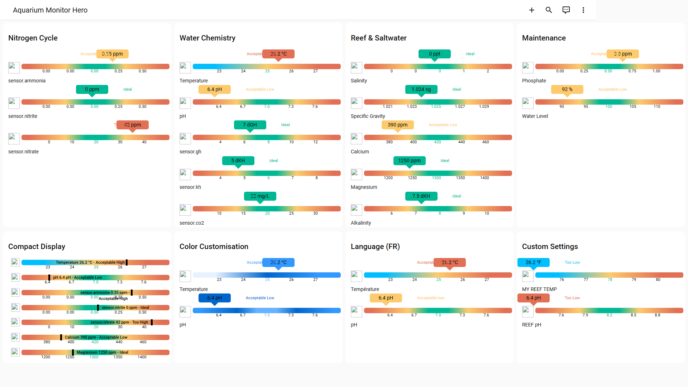

# Aquarium Monitor Card

[![Release][release-shield]][release-link] [![HACS][hacs-shield]][hacs-link] [![GitHub Activity][commits-shield]][commits-link]

> Monitor your aquarium water parameters to keep your fish, corals, and plants healthy — all from your Home Assistant dashboard.



---

## Why this card?

Stable water chemistry is the difference between a thriving tank and a crash. This card tracks up to **15 parameters** with preset ideal ranges for freshwater and reef tanks.

Gradient bars instantly highlight out-of-range values so you can act **before your livestock is stressed** — not after.

Presets are tuned for general freshwater aquariums by default. Reef keepers can override calcium, magnesium, and alkalinity for their higher requirements.

### What you can do

- Track the **nitrogen cycle** (ammonia → nitrite → nitrate) during new tank cycling
- Monitor pH and KH stability for **sensitive species** like discus or shrimp
- Watch calcium, magnesium, and alkalinity for **reef tank coral growth**
- Keep CO2 dialed in for **planted tank** photosynthesis
- Spot salinity drift in your **marine tank** between water changes

---

## Sensors (15 presets)

Every sensor comes with **preset ideal ranges** — just point to your entity and the card handles the rest. Override any value to match your setup.

### Nitrogen Cycle

*The #1 killer in aquariums. Ammonia and nitrite must be zero in a cycled tank.*

| Sensor | Key | Unit | Default Setpoint |
|--------|-----|------|:----------------:|
| Ammonia | `ammonia` | ppm | 0 |
| Nitrite | `nitrite` | ppm | 0 |
| Nitrate | `nitrate` | ppm | 20 |

### Water Chemistry

*Stability matters more than hitting exact numbers. Sudden shifts stress fish.*

| Sensor | Key | Unit | Default Setpoint |
|--------|-----|------|:----------------:|
| Temperature | `temperature` | °C | 25 |
| pH | `ph` | pH | 7.0 |
| General Hardness | `gh` | dGH | 8 |
| Carbonate Hardness | `kh` | dKH | 6 |
| CO2 | `co2` | mg/L | 20 |

### Reef & Saltwater

*Corals consume calcium and alkalinity daily. Keeping them stable is key to growth.*

| Sensor | Key | Unit | Default Setpoint |
|--------|-----|------|:----------------:|
| Salinity | `salinity` | ppt | 0 |
| Specific Gravity | `specific_gravity` | sg | 1.025 |
| Calcium | `calcium` | ppm | 420 |
| Magnesium | `magnesium` | ppm | 1300 |
| Alkalinity | `alkalinity` | dKH | 8 |

### Maintenance

*Prevent phosphate-driven algae and catch evaporation before it concentrates salts.*

| Sensor | Key | Unit | Default Setpoint |
|--------|-----|------|:----------------:|
| Phosphate | `phosphate` | ppm | 0.5 |
| Water Level | `water_level` | % | 100 |

For detailed explanations of each sensor and why it matters, see [Sensor Details](docs/sensors.md).

---

## Compatible Hardware

Community-tested devices that work with this card:

| Device | Integration | Description |
|--------|-------------|-------------|
| Seneye USB Reef/Home | Seneye custom component | Monitors pH, ammonia, temperature, and light. USB connected. |
| GHL ProfiLux | MQTT / REST API | Professional aquarium controller with pH, ORP, conductivity, temperature probes. |
| Atlas Scientific EZO sensors + ESPHome | ESPHome | Lab-grade pH, EC, DO probes on an ESP32. Fully customizable. |
| Xiaomi / Aqara temperature sensors | ZHA / Zigbee2MQTT | Affordable Zigbee temperature sensors. Waterproof versions available for sumps. |

> Know a device that works? [Open an issue](https://github.com/wilsto/aquarium-monitor-card/issues) to add it!

---

## Installation

### HACS (recommended)

1. Open [HACS](https://hacs.xyz/) → **Frontend** → search for **Aquarium Monitor Card**
2. Install and reload your browser

[](https://my.home-assistant.io/redirect/hacs_repository/?owner=wilsto&repository=aquarium-monitor-card&category=plugin)

### Manual

1. Download `aquarium-monitor-card.js` from the [latest release](https://github.com/wilsto/aquarium-monitor-card/releases)
2. Copy to `config/www/community/aquarium-monitor-card/`
3. Add resource: `/local/community/aquarium-monitor-card/aquarium-monitor-card.js` (type: module)

---

## Quick Start

```yaml
type: custom:aquarium-monitor-card
title: "My Aquarium"
sensors:
  temperature:
    entity: sensor.your_temperature_sensor
  ph:
    entity: sensor.your_ph_sensor
  ammonia:
    entity: sensor.your_ammonia_sensor
```

That's it! The card uses sensible defaults for everything else.

---

## Configuration

| Option | Type | Default | Description |
|--------|------|---------|-------------|
| `title` | string | — | Card title |
| `sensors` | object | — | Sensor definitions (see below) |
| `display.compact` | boolean | `false` | Compact display mode |
| `display.show_names` | boolean | `true` | Show sensor names |
| `display.show_icons` | boolean | `true` | Show sensor icons |
| `display.show_units` | boolean | `true` | Show units |
| `display.show_labels` | boolean | `true` | Show range labels |
| `display.gradient` | boolean | `true` | Show gradient bar |
| `display.show_last_updated` | boolean | `false` | Show last update time |
| `display.show_icons` | boolean | `true` | Show sensor icons |
| `language` | string | `en` | Language code |

### Per-sensor overrides

```yaml
sensors:
  temperature:
    entity: sensor.xxx        # required
    name: Custom Name         # override display name
    unit: "°C"                # override unit
    setpoint: 25              # ideal value
    min: 10                   # min of the range
    max: 40                   # max of the range
    step: 2                   # threshold step for colors
    icon: mdi:thermometer     # MDI icon
    mode: centric             # centric | heatflow
```

### Multiple sensors of the same type

```yaml
sensors:
  temperature:
    - entity: sensor.sensor_1
      name: Location 1
    - entity: sensor.sensor_2
      name: Location 2
```

### Languages

12 languages supported: 🇬🇧 English, 🇫🇷 French, 🇩🇪 German, 🇪🇸 Spanish, 🇮🇹 Italian, 🇵🇹 Portuguese, 🇳🇱 Dutch, 🇵🇱 Polish, 🇨🇿 Czech, 🇸🇰 Slovak, 🇮🇱 Hebrew, 🇷🇺 Russian.

---

## Support

[](https://bmc.link/wilsto)

## Monitor Cards Family

This card is part of the **monitor-cards** family — same rendering engine, same features, different presets:

| Card | For | Sensors |
|------|-----|---------|
| [Pool Monitor Card](https://github.com/wilsto/pool-monitor-card) | Pool & spa owners | 20 presets |
| [Aquarium Monitor Card](https://github.com/wilsto/aquarium-monitor-card) | Freshwater & saltwater aquarium keepers | 15 presets ← *you are here* |
| [Air Quality Card](https://github.com/wilsto/air-quality-card) | Homeowners concerned about indoor air quality | 12 presets |
| [Sensor Monitor Card](https://github.com/wilsto/sensor-monitor-card) | Home Assistant power users | unlimited (custom) |

<!-- Badges -->
[release-shield]: https://img.shields.io/github/v/release/wilsto/aquarium-monitor-card?style=flat-square
[release-link]: https://github.com/wilsto/aquarium-monitor-card/releases/latest
[hacs-shield]: https://img.shields.io/badge/HACS-Default-orange.svg?style=flat-square
[hacs-link]: https://hacs.xyz/
[commits-shield]: https://img.shields.io/github/commit-activity/y/wilsto/aquarium-monitor-card?style=flat-square
[commits-link]: https://github.com/wilsto/aquarium-monitor-card/commits/main